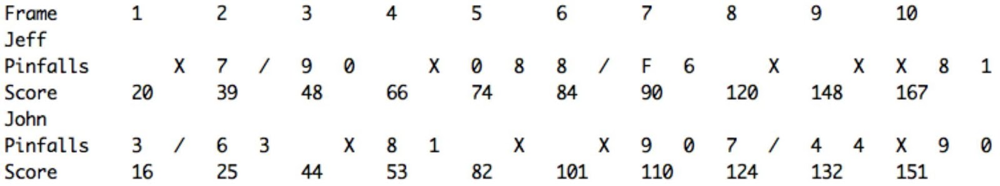
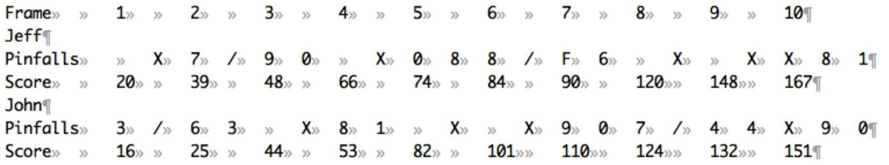
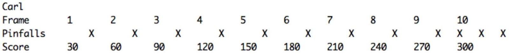

## Description

This project is designed to test your knowledge of the Java language, and assess your ability to create back-­end products with attention to details, standards, and re-usability.

## Assignment

The goal of this exercise is to demonstrate your ability to build a greenfield project, specifically a command-line application to score a game of ten-pin bowling. You can find the rules [here](https://en.wikipedia.org/wiki/Ten-pin_bowling#Rules_of_play). 

The code should handle the bowling scores rules described in the specs and [here](https://www.youtube.com/watch?v=aBe71sD8o8c).

## Mandatory Features

- The program should run from the command-line and take a text file as input

- The program should read the input text file and parse its content, which should have the results for several players bowling 10 frames each, written according to these guidelines:

1. Each line represents a player and a chance with the subsequent number of pins knocked down.
2. An 'F' indicates a foul on that chance and no pins knocked down (identical for scoring to a roll of 0).
3. The columns in each row are tab-separated.

Example:

```
Jeff 10
John 3
John 7
Jeff 7
Jeff 3
John 6
John 3
Jeff 9
Jeff 0
John 10
Jeff 10
John 8
John 1
Jeff 0
Jeff 8
John 10
Jeff 8
Jeff 2
John 10
Jeff F
Jeff 6
John 9
John 0
Jeff 10
John 7
John 3
Jeff 10
John 4
John 4
Jeff 10
Jeff 8
Jeff 1
John 10
John 9
John 0
```

You can find more examples in the tests folder.

- The program should handle bad input like more than ten throws (i.e., no chance will produce a negative number of knocked down pins or more than 10, etc), invalid score value or incorrect format

- The program should output the scoring for the associated game according to these guidelines:

1. For each player, print their name on a separate line before printing that player's pinfalls and score.
2. All values are tab-separated.
3. The output should calculate if a player scores a strike ('X'), a spare ('/') and allow for extra chances in the tenth frame.

So for the above game for Jeff, the classic scoring would be written:


Your program should print out a similar score to standard out, in the format: 



Here is the same output with hidden whitespace revealed:



Your program should be able to handle all possible cases of a game both including a game where all rolls are 0, all rolls are fouls (F) and a perfect game, where all rolls are strikes:

```
Carl 10
Carl 10
Carl 10
Carl 10
Carl 10
Carl 10
Carl 10
Carl 10
Carl 10
Carl 10
Carl 10
Carl 10
```




- Unit test: Tests should cover at least the non-trivial classes and methods

- Integration test: At least cover the three main cases: Sample input (2 players), perfect score, zero score

## Bonus features

- Use Java 8 streams and lambdas

## Considerations

- SRP: Single Responsibility Principle (Classes are self contained. They do the task they need to do and nothing else).
- Liskov’s Substitution Principle: Interfaces (OOP, Swap principle.. Makes the program able to be extended).
- Dependency Inversion Principle: Code should depend on interfaces, no concrete implementations.
- Include well-known libraries and good use of the JDK API.
- Build mechanism (gradle, maven, shell, NO IDE). Program should compile and run out of the box.
- Packaging complete. Zip should contain a readme file explaining how to compile the project, and contain the test text file to check the output
- Project structure: It should be the standard Maven project layout, no IDE specific or custom.
- Keep your code versioned with Git locally.
